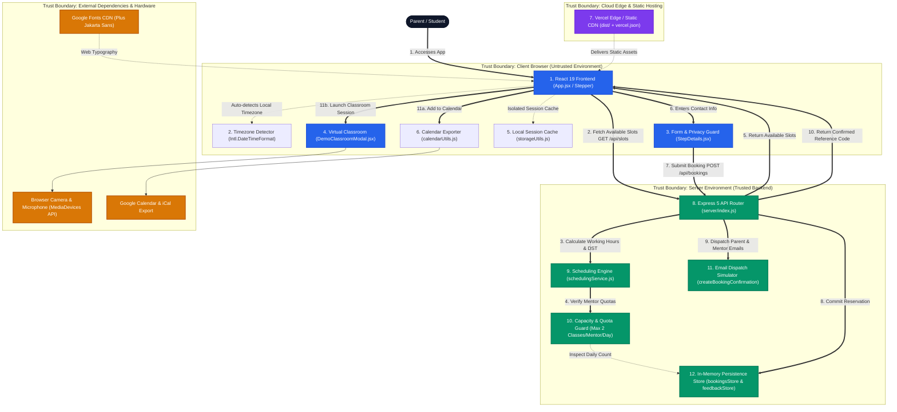

# Anvesha

> **Discover. Connect. Learn.**  
> 🌐 **Live Website:** [https://code-young-anvesha.vercel.app](https://code-young-anvesha.vercel.app)

Anvesha is an intuitive 1-on-1 trial class appointment booking platform designed to streamline scheduling between international parents (US/UK) and educators in India. Parents can select a specialized learning track (Scratch, Python, Web Dev, Math & Logic), choose a convenient time slot in their local timezone, get automatically paired with a certified mentor, receive instant calendar invites & live classroom links, and attend an interactive virtual demo session.

---

## 🚀 Quick Start

### Option A: 1-Click Launchers (Easiest)
```bash
git clone https://github.com/pajju011/CodeYoung_Anvesha.git
cd CodeYoung_Anvesha
```
- **Windows:** Double-click [`run.bat`](https://github.com/pajju011/CodeYoung_Anvesha/blob/main/run.bat) (or run `run.bat` in terminal)
- **macOS / Linux:** Run `./run.sh` in terminal

*(Verifies Node.js, auto-installs dependencies if missing, starts both Express & Vite, and opens your browser)*

---

### Option B: Terminal Commands (Cross-Platform)
```bash
git clone https://github.com/pajju011/CodeYoung_Anvesha.git
cd CodeYoung_Anvesha

# Install dependencies
npm install

# Start both Express backend and React frontend
npm run dev
```

---

### 🌐 Access Links
- **Live Production App:** [https://code-young-anvesha.vercel.app](https://code-young-anvesha.vercel.app)
- **Live Demo Classroom:** [https://code-young-anvesha.vercel.app/?view=classroom&id=demo_session](https://code-young-anvesha.vercel.app/?view=classroom&id=demo_session)
- **Local Frontend:** [http://localhost:5173](http://localhost:5173)
- **Local Backend API:** [http://localhost:3001/api/health](http://localhost:3001/api/health)
- **Local Classroom:** [http://localhost:5173/?view=classroom&id=demo_session](http://localhost:5173/?view=classroom&id=demo_session)

---

## ✨ Features

- **Cross-Timezone & DST:** Dual clock displays for parents (US/UK) and mentors (India) with automated Daylight Saving Time adjustment.
- **Mentor Capacity Management:** Auto-matching across 10 mentors, strictly capped at 2 sessions/day per mentor (20 sessions/day max).
- **Virtual Classroom:** Interactive trial room with mic/camera test, collaborative whiteboard, live code runner, and chat.
- **Privacy & Data Protection:** Strict session isolation preventing customer contact details from being exposed or pre-filled on shared devices.
- **Calendar & Notifications:** Instant Google Calendar sync, `.ics` iCal download, and simulated email dispatches.
- **Session Feedback:** Built-in post-class review and rating system.

---

## 🏗️ System Architecture

### Runtime Architecture & Trust Boundaries



### Architecture Highlights
- **Primary Booking Path (`==>`):** User accesses React client $\rightarrow$ auto-detects timezone $\rightarrow$ fetches available slots via Express API $\rightarrow$ scheduling engine computes slots with DST & quota limits $\rightarrow$ user inputs contact details with privacy guard $\rightarrow$ backend confirms booking, stores state, dispatches simulated emails, and returns reference code $\rightarrow$ user syncs calendar or joins virtual classroom.
- **12 Core Components:** Organized across 4 explicit trust boundaries (Client Browser, Cloud Edge, Application Server, External Services/Hardware).
- **Data Privacy & Isolation:** Client inputs use `autoComplete="off"` with complete separation between sessions; public API queries never expose customer contact details.

---

## 🛠️ Tech Stack

- **Frontend:** React 19, Vite, Vanilla CSS, Lucide Icons
- **Backend:** Node.js, Express 5
- **Deployment:** [Vercel (code-young-anvesha.vercel.app)](https://code-young-anvesha.vercel.app)

---

## 📡 API Endpoints

- `GET /api/mentors` — List mentors and remaining daily quota
- `GET /api/slots` — Available slots by date and timezone
- `POST /api/bookings` — Confirm booking, assign mentor, and dispatch emails
- `DELETE /api/bookings/:id` — Cancel a booking
- `POST /api/feedback` — Submit session review and rating

---

## 📄 License

This project is open-source and available under the [MIT License](./LICENSE).

---

## 👨‍💻 Author

Developed by **[Prajwal R Poojary](https://github.com/pajju011)**

