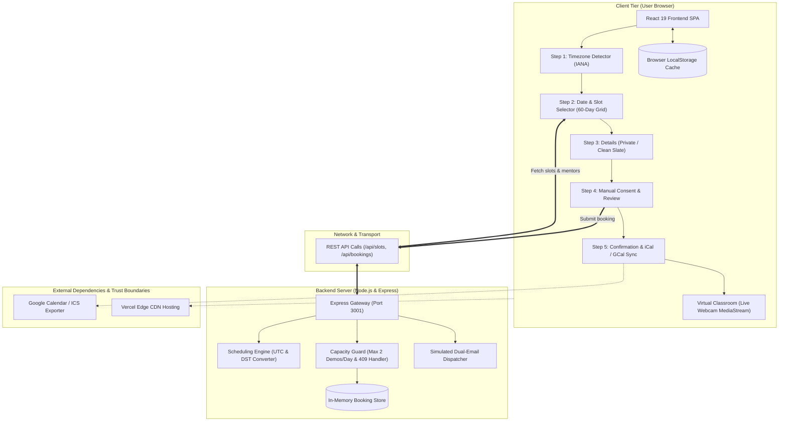

# Anvesha — 1-on-1 Trial Class Appointment-Booking System
> **Discover. Connect. Learn.**

A full-stack, production-grade appointment booking platform built for 1-on-1 trial class experiences (Codeyoung engineering assignment). The system enables parents to select convenient time slots, coordinates cross-timezone schedules between international parents (US/UK) and educators (India), strictly enforces educator capacity limits, handles Daylight Saving Time (DST) shifts, and automatically dispatches live classroom links and simulated calendar invitations.

🌐 **Live Deployment:** [https://code-young-anvesha.vercel.app](https://code-young-anvesha.vercel.app)  
📁 **Repository:** [https://github.com/pajju011/CodeYoung_Anvesha.git](https://github.com/pajju011/CodeYoung_Anvesha.git)

---

## 📋 Requirements & Evaluation Compliance Matrix

| Requirement | Implementation Detail | Status |
|---|---|---|
| **1. 10 Mentors for Trial Classes** | 10 realistic educator profiles (`server/data/mentors.js` and `src/data/mentors.js`) with specialized curricula (Scratch, Python, Web Dev, Math & Logic). In line with the prompt (*"Usually, parents are in the US or UK, and mentors are in India"*), 7 mentors are in India (`Asia/Kolkata` - IST), 2 in the UK (`Europe/London` - GMT/BST), and 1 in the US (`America/New_York` - EST/EDT). | ✅ Complete |
| **2. 20 Parents/Day Capacity** | The math matches exactly: 10 mentors × 2 demo classes/day = **20 demo classes maximum capacity per day**. Day-wide capacity metrics and slot availability are tracked dynamically. | ✅ Complete |
| **3. Different Timezones Communication** | All schedule slots and confirmations display **both parent local time** (e.g. `11:00 AM EDT`) and **mentor local time** (e.g. `8:30 PM IST`). | ✅ Complete |
| **4. Daylight Savings Time (DST)** | Scheduling engine operates on standardized UTC timestamps. Uses standard IANA timezone identifiers (`America/New_York`, `Europe/London`, `Asia/Kolkata`) via `Intl.DateTimeFormat` which natively handles historical and future DST shifts (e.g., 9.5-hour difference in summer EDT vs 10.5-hour in winter EST with India IST). An active DST indicator is surfaced in the UI. | ✅ Complete |
| **5. Dummy Live Class Link** | Every confirmed booking generates a unique meeting URL (e.g. `https://code-young-anvesha.vercel.app/?view=classroom&id=...`). Clicking **[ Join Demo Class ]** opens a functional, interactive **Virtual Classroom Test Room** with live device webcam hardware streaming, mic meter, code canvas, and trial lesson agenda. | ✅ Complete |
| **6. Max 2 Demo Classes/Day per Mentor** | Hard constraint strictly enforced in `server/services/schedulingService.js`, `server/index.js`, and `src/utils/timezoneUtils.js`. If a mentor already has 2 confirmed sessions on that calendar day (in their local timezone / IST), they are completely filtered out of available slots. Direct API attempts receive `HTTP 409 Conflict`. | ✅ Complete |
| **7. Meaningful Error & Empty States** | Clear, user-friendly communication when slots are unavailable: *"No trial classes are available on this date. All mentors are booked or outside their working hours. Please choose another date."* | ✅ Complete |
| **8. Email Notifications to Both Parent & Mentor** | When a trial class is booked, simulated email dispatches are generated for **both** the parent and the mentor with customized local times, session curriculum, and the live classroom link. Viewable directly in the UI via the **Email Invitations Dispatched** audit panel. | ✅ Complete |
| **9. Full Stack Architecture** | **Backend:** Node.js + Express API (`/api/mentors`, `/api/slots`, `/api/bookings`). <br>**Frontend:** React 19 + Vanilla CSS design system + Lucide icons. | ✅ Complete |
| **10. AI Pair Programming Transcript** | Full transcript exported as [`TRANSCRIPT.md`](./TRANSCRIPT.md) in the repository root. | ✅ Complete |

---

## 🏛️ High-Level Runtime Architecture



---

## 🎨 Design Principles & Anti-"AI Slop" Standards

- **No Purple Gradients:** Built with a restrained, trustworthy education color palette: deep royal blue (`#1E40AF`), slate neutrals (`#0F172A`, `#334155`), and accessible borders (`#E2E8F0`).
- **No Pill Buttons Everywhere:** Real interactive application buttons with intentional, moderate border radius (6px - 8px) and distinct visual hierarchies.
- **No Fake Reviews or Metrics:** Zero invented testimonials, zero fake ratings, zero artificial counters, and zero marketing puffery.
- **Human, Purpose-Driven Copy:** Direct and clear product communication ("Book a Free Trial Class", "Choose a convenient time for your child and we'll match you with an available mentor").
- **Consistent Icons:** Exclusively using [Lucide React](https://lucide.dev/) icons (`Calendar`, `Clock`, `Globe`, `User`, `Mail`, `Video`, `CheckCircle2`), never random emojis.
- **User Agency:** Mandatory checkboxes (e.g. Terms & Availability Confirmation) are **unfilled by default**, ensuring users actively review and confirm before submission.
- **Data Privacy:** Customer information is not exposed or prefilled across separate visitor sessions.

---

## 🧭 The 5-Step Scheduling Flow

1. **Step 1 — Your Timezone**
   - Automatically detects user timezone from browser environment.
   - Searchable global timezone selector with IANA IDs, city names, and UTC offsets.
   - Highlights whether Daylight Saving Time (DST) is active.

2. **Step 2 — Date & Time**
   - Track filter: *Scratch & Visual Coding*, *Python for Beginners*, *Web Development Basics*, *Math & Computational Logic*.
   - 60-day interactive date selector with full monthly calendar picker modal.
   - Slots grouped into Morning, Afternoon, and Evening.
   - Real-time mentor matching preview on each slot card showing educator name and mentor's local time.
   - Strictly hides mentors who have already reached their 2 demo classes/day cap.

3. **Step 3 — Parent & Student Details**
   - Form fields for parent contact (Full Name, Email, Phone/WhatsApp) and student details (Name, Age group, Prior coding experience, Learning goals).
   - Real-time validation with descriptive, accessible error messages.

4. **Step 4 — Review & Verification**
   - Side-by-side comparison of session details: Parent Local Time vs. Mentor Local Time.
   - Assigned educator credentials and working timezone.
   - Interactive terms & availability checkbox (must be manually checked by user).

5. **Step 5 — Booking Confirmation**
   - Confirmation banner with unique booking reference code (e.g. `#CY-38083`).
   - One-click Google Calendar event generation.
   - One-click `.ics` iCalendar file download for Apple Calendar / Outlook.
   - Expandable **Email Invitations Dispatched** panel showing simulated emails sent to both parent and mentor.
   - Direct button to launch the **Live Classroom Testing Room** with hardware camera support.

---

## 👩‍🏫 Demo Educators Roster (10 Mentors)

Seeded specifically for Codeyoung's trial class operations across timezones:

1. **Priya Nair** — Lead Scratch & Python Educator · *Bengaluru, India (IST / UTC+5:30)* · B.Tech NIT Calicut
2. **Amit Sharma** — Robotics & Logic Specialist · *New Delhi, India (IST / UTC+5:30)* · M.Sc. Delhi University
3. **Ananya Patel** — Early Coding & Creative Computing · *Mumbai, India (IST / UTC+5:30)* · B.Ed & B.Sc. Mumbai Univ
4. **Rohan Verma** — Senior Python & Web Dev Instructor · *Hyderabad, India (IST / UTC+5:30)* · B.E. BITS Pilani
5. **Neha Joshi** — STEM & Game Mechanics Educator · *Pune, India (IST / UTC+5:30)* · M.Tech IIT Roorkee
6. **Vikram Rao** — Applied Computing & Algorithms Mentor · *Bengaluru, India (IST / UTC+5:30)* · B.Tech RVCE
7. **Sneha Kulkarni** — Interactive Frontend & Visual Design · *Pune, India (IST / UTC+5:30)* · B.Sc. Pune Univ
8. **Sarah Jenkins** — Web Technologies Instructor · *London, UK (BST / UTC+1:00)* · B.Sc. Univ of Bristol
9. **Liam O’Connor** — Computing & Logic Mentor · *Manchester, UK (BST / UTC+1:00)* · B.Sc. Trinity College Dublin
10. **David Chen** — Computer Science Instructor · *New York, US (EDT / UTC-4:00)* · B.S. Univ of Michigan

---

## 🚀 Running the Project

### Clone Repository
```bash
git clone https://github.com/pajju011/CodeYoung_Anvesha.git
cd CodeYoung_Anvesha
```

### Option A: 1-Click Launchers (Easiest)
- **Windows:** Double-click [`run.bat`](./run.bat) (or run `.\run.bat` in PowerShell / CMD).
- **macOS / Linux:** Run `./run.sh` in terminal (`chmod +x run.sh && ./run.sh`).
*(Automatically verifies Node.js, auto-installs npm dependencies if missing, starts both Express & Vite concurrently, and opens your browser).*

### Option B: Manual CLI Execution
```bash
# 1. Install dependencies
npm install

# 2. Start both Express Backend (Port 3001) and Vite React Frontend (Port 5173)
npm run dev
```

### URLs
- **Frontend Web Application:** [http://localhost:5173/](http://localhost:5173/)
- **Backend API Health Check:** [http://localhost:3001/api/health](http://localhost:3001/api/health)
- **Live Classroom Preview:** [http://localhost:5173/?view=classroom&id=demo_session](http://localhost:5173/?view=classroom&id=demo_session)
- **Production Deployment:** [https://code-young-anvesha.vercel.app](https://code-young-anvesha.vercel.app)

---

## 📦 Submission Details

- **Target Email:** `campus.ka@talentiseglobal.com`
- **Deadline:** Within 28th of September 2026 (Latest by 6:00 PM)
- **Subject Line Format:** `Codeyoung Assignment Task - <Candidate Name> - Institute Name (ABBR)`
- **Repository Contents:**
  - `README.md` — Project documentation and setup guide
  - `TRANSCRIPT.md` — Full conversation transcript of the AI pair programming session
  - `server/` — Node.js Express backend API
  - `src/` — React frontend with appointment booking flow
